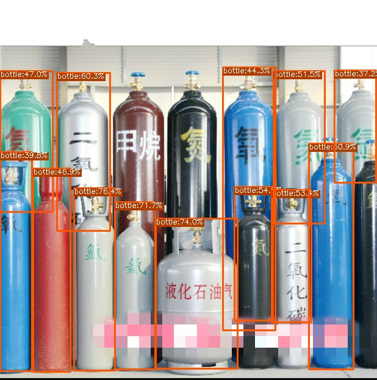

# YOLO Series TensorRT Python/C++ 
## [简体中文](README_CN.md)

## Support
YOLOv7、YOLOv6、 YOLOX、 YOLOV5

The C++ code for YOLOv7/YOLOv6 also can be used for YOLOx or YOLOv5

## Update 
- 2022.8.11 nms plugin support ==> Now you can set --end2end flag while use `export.py` get a engine file  
- 2022.7.8 support YOLOV7 
- 2022.7.3 support TRT int8  post-training quantization 

##  Prepare TRT Env 
`Python`
```
pip install --upgrade setuptools pip --user
pip install nvidia-pyindex
pip install --upgrade nvidia-tensorrt
pip install pycuda
```
`C++`

[By Docker](https://github.com/NVIDIA/TensorRT/blob/main/docker/ubuntu-20.04.Dockerfile)

## Quick Start

Here is a Python Demo mybe help you quickly understand this repo [Link](https://aistudio.baidu.com/aistudio/projectdetail/4263301?contributionType=1&shared=1)

## YOLOv7 [C++, Python Support]



```shell
https://github.com/WongKinYiu/yolov7.git
```

Modify code: Modify the yolo.py as follows:
https://github.com/WongKinYiu/yolov7/blob/5f1b78ad614b45c5a98e7afdd295e20033d5ad3c/models/yolo.py#L57 

```python
return x if self.training else (torch.cat(z, 1), ) if not self.export else (torch.cat(z, 1), x)
```

### Export onnx
```shell
python models/export.py --weights ../yolov7.pt --grid
```

### Convert to TensorRT Engine 

```
python export.py -o onnx-name -e trt-name -p fp32/16/int8

                                --end2end export the model include nms plugin

```
### Test

```
cd yolov7
python trt.py
```
tips!

if you use the end2end model please modift the code as such

`origin_img = pred.inference(img_path, conf=0.5, end2end=True)`

### C++ [Now don't support end2end model]

C++ [Demo](yolov7/cpp/README.md)


## YOLOv6 [C++, Python Support]

| model |  input |  | FPS | Device | Language | 
| -------- | -------- | -------- | ------- | ------- | ------|
| yolov6s     | 640*640     | FP16     | 360FPS  | A100 | Python |
| yolov6s     | 640*640     | FP32     | 350FPS | A100| Python |
| yolov6s     | 640*640     | FP32     | 330FPS | 1080Ti | C++ |
| yolov6s     | 640*640     | FP32     | 300FPS | 1080Ti | Python |

[YOLOv6 bilibili](https://www.bilibili.com/video/BV1x3411w7T6?share_source=copy_web)


```shell
git clone https://github.com/meituan/YOLOv6.git
```
### Export onnx
```shell
python deploy/ONNX/export_onnx.py --weights yolov6s.pt --img 640 --batch 1
```

### Convert to TensorRT Engine 

```
python export.py -o onnx-name -e trt-name -p fp32/16/int8 --end2end 
```
### Test

```
cd yolov6
python trt.py
```

### C++ [Now don't support end2end model]

C++ [Demo](yolov6/cpp/README.md)

## YOLOX [Python Support]

### Export ONNX

```
git clone https://github.com/Megvii-BaseDetection/YOLOX.git
```
```python

Modify export_onnx.py as model.head.decode_in_inference = True

Modify yolox/models/yolox_head.py

# [batch, n_anchors_all, 85]
# outputs = torch.cat(
#     [x.flatten(start_dim=2) for x in outputs], dim=2

# ).permute(0, 2, 1)
outputs = torch.cat(
    [x.view(-1,int(x.size(1)),int(x.size(2)*x.size(3))) for x in outputs], dim=2

).permute(0, 2, 1)

# outputs[..., :2] = (outputs[..., :2] + grids) * strides
# outputs[..., 2:4] = torch.exp(outputs[..., 2:4]) * strides
# return outputs
xy =  (outputs[..., :2] + grids) * strides
wh = torch.exp(outputs[..., 2:4]) * strides
return torch.cat((xy, wh, outputs[..., 4:]), dim=-1)

```
```python
python3 tools/export_onnx.py --output-name yolox_s.onnx -n yolox-s -c yolox_s.pth
```
### Convert to TensorRT Engine 
```
python export.py -o onnx-name -e trt-name -p fp32/16/int8
```
### Test

```
cd yolovx
python trt.py
```

## YOLOV5 [Python Support]


### Export ONNX

```
git clone https://github.com/ultralytics/yolov5.git
```

```python
python path/to/export.py --weights yolov5s.pt --include  onnx 
```

### Convert to TensorRT Engine 

```
python export.py -o onnx-name -e trt-name -p fp32/16/int8
```
### Test

```
cd yolov5
python trt.py
```