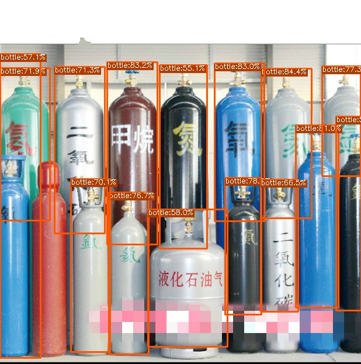
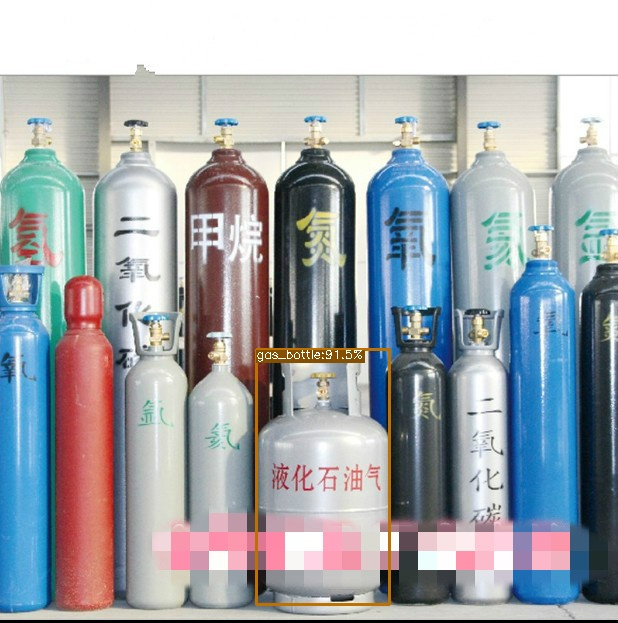

# YOLOv6、 YOLOX、 YOLOV5、 TensorRT Python/C++ API 
## Update 2022.7.3 support TRT int8  post-training quantization 


##  Prepare TRT Python 

```
pip install --upgrade setuptools pip --user
pip install nvidia-pyindex
pip install --upgrade nvidia-tensorrt
pip install pycuda
```


Here is a Python Demo mybe help you quickly understand this repo [Link](https://aistudio.baidu.com/aistudio/projectdetail/4263301?contributionType=1&shared=1)
## YOLOv6 [C++, Python Support]

| model |  input |  | FPS | Device | Language | 
| -------- | -------- | -------- | ------- | ------- | ------|
| yolov6s     | 640*640     | FP16     | 360FPS  | A100 | Python |
| yolov6s     | 640*640     | FP32     | 350FPS | A100| Python |
| yolov6s     | 640*640     | FP32     | 330FPS | 1080Ti | C++ |
| yolov6s     | 640*640     | FP32     | 300FPS | 1080Ti | Python |

[bilibili](https://www.bilibili.com/video/BV1x3411w7T6?share_source=copy_web)


```shell
git clone https://github.com/meituan/YOLOv6.git
```
### 导出onnx
```shell
python deploy/ONNX/export_onnx.py --weights yolov6s.pt --img 640 --batch 1
```

### 转化为TensorRT Engine 

```
python export.py -o onnx-name -e trt-name -p fp32/16/int8
```
### 测试

```
cd yolov6
python trt.py
```

### C++

C++ [Demo](yolov6/cpp/README.md)

## YOLOX [Python Support]

### 导出ONNX

```
git clone https://github.com/Megvii-BaseDetection/YOLOX.git
```
```python

修改 export_onnx.py 为 model.head.decode_in_inference = True

修改 yolox/models/yolox_head.py文件

# [batch, n_anchors_all, 85]
# outputs = torch.cat(
#     [x.flatten(start_dim=2) for x in outputs], dim=2

# ).permute(0, 2, 1)
outputs = torch.cat(
    [x.view(-1,int(x.size(1)),int(x.size(2)*x.size(3))) for x in outputs], dim=2

).permute(0, 2, 1)

# outputs[..., :2] = (outputs[..., :2] + grids) * strides
# outputs[..., 2:4] = torch.exp(outputs[..., 2:4]) * strides
# return outputs
xy =  (outputs[..., :2] + grids) * strides
wh = torch.exp(outputs[..., 2:4]) * strides
return torch.cat((xy, wh, outputs[..., 4:]), dim=-1)

```
```python
python3 tools/export_onnx.py --output-name yolox_s.onnx -n yolox-s -c yolox_s.pth
```
### 转化为TensorRT Engine 
```
python export.py -o onnx-name -e trt-name -p fp32/16/int8
```
### 测试

```
cd yolovx
python trt.py
```

## YOLOV5 [Python Support]


### 导出ONNX

```
git clone https://github.com/ultralytics/yolov5.git
```

```python
python path/to/export.py --weights yolov5s.pt --include  onnx 
```

### 转化为TensorRT Engine 

```
python export.py -o onnx-name -e trt-name -p fp32/16/int8
```
### 测试

```
cd yolov5
python trt.py
```
