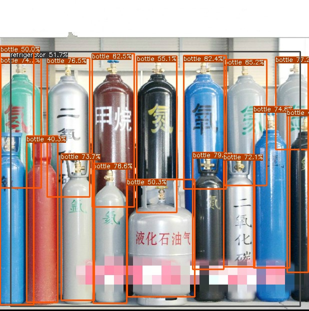

# YOLOV6-TensorRT in C++

## Step 1: 准备TRT序列化引擎


```shell
git clone https://github.com/meituan/YOLOv6.git
```
### 导出onnx
```shell
python deploy/ONNX/export_onnx.py --weights yolov6s.pt --img 640 --batch 1
```

### 转化为TensorRT Engine 

```
python export_trt.py -m onnx-name -o trt-name
```
### 测试

```
cd yolov6
python trt.py
```

| model |  input |  | FPS | Device | Language | 
| -------- | -------- | -------- | ------- | ------- | ------|
| yolov6s     | 640*640     | FP16     | 360FPS  | A100 | Python |
| yolov6s     | 640*640     | FP32     | 350FPS | A100| Python |
| yolov6s     | 640*640     | FP32     | 300FPS | 1080Ti | C++ |

Here is a Python Demo mybe help quickly understand this repo [Link](https://aistudio.baidu.com/aistudio/projectdetail/4263301?contributionType=1&shared=1)

## Step 2: C++

Please follow the [TensorRT Installation Guide](https://docs.nvidia.com/deeplearning/tensorrt/install-guide/index.html) to install TensorRT.

And you should set the TensorRT path and CUDA path in CMakeLists.txt.

If you train your custom dataset, you may need to modify the value of `num_class`.

```c++
const int num_class = 80;
```

Install opencv with ```sudo apt-get install libopencv-dev``` (we don't need a higher version of opencv like v3.3+). 

build the demo:

```shell
mkdir build
cd build
cmake ..
make
```

Then run the demo:

```shell
./yolov6 ../model_trt.engine -i ../../../../assets/dog.jpg
```

or

```shell
./yolov6 <path/to/your/engine_file> -i <path/to/image>
```


